> base on [gin v1.8.1](https://github.com/gin-gonic/gin/tree/v1.8.1)
>
> TODO:
>
> - [ ] https://gin-gonic.com/zh-cn/#td-block-1 这个网站介绍的每一个特点，都看过实现了吗？


# gin 的运行概览


## demo

```go
package main

import (
	"net/http"

	"github.com/gin-gonic/gin"
)

func main() {
	r := gin.Default()
	r.GET("/ping", func(c *gin.Context) {
		c.JSON(http.StatusOK, gin.H{
			"message": "pong",
		})
	})
	r.Run() // listen and serve on 0.0.0.0:8080 (for windows "localhost:8080")
}
```

```bash
# 发送方
[root@LC demo_in_README]# curl -v -i  http://localhost:8080/ping
*   Trying 127.0.0.1:8080...
* Connected to localhost (127.0.0.1) port 8080 (#0)
> GET /ping HTTP/1.1
> Host: localhost:8080
> User-Agent: curl/7.83.1
> Accept: */*
> 
* Mark bundle as not supporting multiuse
< HTTP/1.1 200 OK
HTTP/1.1 200 OK
< Content-Type: application/json; charset=utf-8
Content-Type: application/json; charset=utf-8
< Date: Sat, 22 Oct 2022 05:42:49 GMT
Date: Sat, 22 Oct 2022 05:42:49 GMT
< Content-Length: 18
Content-Length: 18

< 
* Connection #0 to host localhost left intact
{"message":"pong"}


# 接受方
[root@LC demo_in_README]# go run quick_start.go 
[GIN-debug] [WARNING] Creating an Engine instance with the Logger and Recovery middleware already attached.

[GIN-debug] [WARNING] Running in "debug" mode. Switch to "release" mode in production.
 - using env:	export GIN_MODE=release
 - using code:	gin.SetMode(gin.ReleaseMode)

[GIN-debug] GET    /ping                     --> main.main.func1 (3 handlers)
[GIN-debug] [WARNING] You trusted all proxies, this is NOT safe. We recommend you to set a value.
Please check https://pkg.go.dev/github.com/gin-gonic/gin#readme-don-t-trust-all-proxies for details.
[GIN-debug] Environment variable PORT is undefined. Using port :8080 by default
[GIN-debug] Listening and serving HTTP on :8080
[GIN] 2022/10/22 - 13:41:31 | 404 |       2.163µs |       127.0.0.1 | GET      "/"
[GIN] 2022/10/22 - 13:41:38 | 200 |     104.465µs |       127.0.0.1 | GET      "/ping"
[GIN] 2022/10/22 - 13:41:41 | 200 |      49.832µs |       127.0.0.1 | GET      "/ping"
[GIN] 2022/10/22 - 13:42:38 | 200 |      31.665µs |       127.0.0.1 | GET      "/ping"
[GIN] 2022/10/22 - 13:42:49 | 200 |     103.623µs |       127.0.0.1 | GET      "/ping"
```


## 流程分析

```go
// step 1: 创建 gin.Engine
// Default returns an Engine instance with the Logger and Recovery middleware already attached.
// 采用 gin 的默认配置生成一个 gin.Engine instance
func Default() *Engine {
	.........
	engine := New()
	.........
	return engine
}

// step 2: 往 gin.Engine 注册 URL 路由监听及相应的回调函数
// GET is a shortcut for router.Handle("GET", path, handle).
func (group *RouterGroup) GET(relativePath string, handlers ...HandlerFunc) IRoutes {
	return group.handle(http.MethodGet, relativePath, handlers)
}

// step 3: 启动监听，开始接收请求
// Run attaches the router to a http.Server and starts listening and serving HTTP requests.
// It is a shortcut for http.ListenAndServe(addr, router)
// Note: this method will block the calling goroutine indefinitely unless an error happens.
func (engine *Engine) Run(addr ...string) (err error) {
	.........

	address := resolveAddress(addr)
	debugPrint("Listening and serving HTTP on %s\n", address)
	// 平淡无奇的利用标注库 ListenAndServe 开始监听
	// 但是，实际上利用了 engine.Handler() 注入了 gin 自己的路由组件
	// 默认情况下采用 gin.Engine.ServeHTTP() 作为路由分发，实际上因为
	// http.ListenAndServe() 填入了 Handler，而且不是使用标准库体统的 mux
	// 所以 http package 仅仅是帮我们完成 TCP 链接，基础的 HTTP 设置，以及 goroutine 启动
	// 实际的路由分发，是由 gin.Engine.ServeHTTP() 负责的
	err = http.ListenAndServe(address, engine.Handler())
	return
}

// step 4: 请求来了
// step 4.1: 现有 HTTP 标准库完成 TCP、HTTP 设置，然后交由下面的函数进行路由分发
// step 4.2: 路由分发与 response
// 实际上这个函数，是并发的运行在多个 goroutine 上的
// 这也就意味着，gin.Engine 里面的资源是会被并发访问的
// ServeHTTP conforms to the http.Handler interface.
func (engine *Engine) ServeHTTP(w http.ResponseWriter, req *http.Request) {
	c := engine.pool.Get().(*Context)

	// w, req 两个参数都装进 gin.Context 里面
	// 后续只传递 gin.Context 就完事了
	c.writermem.reset(w)
	c.Request = req
	c.reset()

	engine.handleHTTPRequest(c)

	engine.pool.Put(c)
}

// step 5: 路由分发并处理请求
func (engine *Engine) handleHTTPRequest(c *Context) {
	/* http method */
	httpMethod := c.Request.Method

	/* 整理 URL */
	rPath := c.Request.URL.Path
	unescape := false
	if engine.UseRawPath && len(c.Request.URL.RawPath) > 0 {
		rPath = c.Request.URL.RawPath
		unescape = engine.UnescapePathValues
	}

    ..........
    
	/* 根据相应的 http method 进行 URL 路由匹配 */
	// Find root of the tree for the given HTTP method
	t := engine.trees
	for i, tl := 0, len(t); i < tl; i++ {
		if t[i].method != httpMethod {
			// Q&A(DONE): 为什么是 slice 遍历？
			// 因为在 size 比较小的情况下，slice 的 access 速度比 map 快了一个数量级
			// 所以即便是时间复杂度为 O(n) 的 slice 遍历，工程上也是比时间复杂度为 O(1) 的 map 更快的
			continue
		}
		root := t[i].root
		// Find route in tree
		value := root.getValue(rPath, c.params, c.skippedNodes, unescape)
		if value.params != nil {
			c.Params = *value.params
		}
		if value.handlers != nil {
			// 成功找到 node，且这个 node 是有注册
			c.handlers = value.handlers
			c.fullPath = value.fullPath
			c.Next() // 开始把所有注册在这个 route node 上面的 handler 都调用一次
			c.writermem.WriteHeaderNow()
			return // 本次 http request 完事
		}
		........
	}

	........
}
```


# `Engine` struct

```go
var _ IRouter = &Engine{}

// Engine is the framework's instance, it contains the muxer, middleware and configuration settings.
// Create an instance of Engine, by using New() or Default()
type Engine struct {
	RouterGroup

	// RedirectTrailingSlash enables automatic redirection if the current route can't be matched but a
	// handler for the path with (without) the trailing slash exists.
	// For example if /foo/ is requested but a route only exists for /foo, the
	// client is redirected to /foo with http status code 301 for GET requests
	// and 307 for all other request methods.
	RedirectTrailingSlash bool

	// RedirectFixedPath if enabled, the router tries to fix the current request path, if no
	// handle is registered for it.
	// First superfluous path elements like ../ or // are removed.
	// Afterwards the router does a case-insensitive lookup of the cleaned path.
	// If a handle can be found for this route, the router makes a redirection
	// to the corrected path with status code 301 for GET requests and 307 for
	// all other request methods.
	// For example /FOO and /..//Foo could be redirected to /foo.
	// RedirectTrailingSlash is independent of this option.
	RedirectFixedPath bool

	// HandleMethodNotAllowed if enabled, the router checks if another method is allowed for the
	// current route, if the current request can not be routed.
	// If this is the case, the request is answered with 'Method Not Allowed'
	// and HTTP status code 405.
	// If no other Method is allowed, the request is delegated to the NotFound
	// handler.
	HandleMethodNotAllowed bool

	// ForwardedByClientIP if enabled, client IP will be parsed from the request's headers that
	// match those stored at `(*gin.Engine).RemoteIPHeaders`. If no IP was
	// fetched, it falls back to the IP obtained from
	// `(*gin.Context).Request.RemoteAddr`.
	ForwardedByClientIP bool

	// AppEngine was deprecated.
	// Deprecated: USE `TrustedPlatform` WITH VALUE `gin.PlatformGoogleAppEngine` INSTEAD
	// #726 #755 If enabled, it will trust some headers starting with
	// 'X-AppEngine...' for better integration with that PaaS.
	AppEngine bool

	// UseRawPath if enabled, the url.RawPath will be used to find parameters.
	UseRawPath bool

	// UnescapePathValues if true, the path value will be unescaped.
	// If UseRawPath is false (by default), the UnescapePathValues effectively is true,
	// as url.Path gonna be used, which is already unescaped.
	UnescapePathValues bool

	// RemoveExtraSlash a parameter can be parsed from the URL even with extra slashes.
	// See the PR #1817 and issue #1644
	RemoveExtraSlash bool

	// RemoteIPHeaders list of headers used to obtain the client IP when
	// `(*gin.Engine).ForwardedByClientIP` is `true` and
	// `(*gin.Context).Request.RemoteAddr` is matched by at least one of the
	// network origins of list defined by `(*gin.Engine).SetTrustedProxies()`.
	RemoteIPHeaders []string

	// TrustedPlatform if set to a constant of value gin.Platform*, trusts the headers set by
	// that platform, for example to determine the client IP
	TrustedPlatform string

	// MaxMultipartMemory value of 'maxMemory' param that is given to http.Request's ParseMultipartForm
	// method call.
	MaxMultipartMemory int64

	// UseH2C enable h2c support.
	UseH2C bool

	// ContextWithFallback enable fallback Context.Deadline(), Context.Done(), Context.Err() and Context.Value() when Context.Request.Context() is not nil.
	ContextWithFallback bool

	delims           render.Delims
	secureJSONPrefix string
	HTMLRender       render.HTMLRender
	FuncMap          template.FuncMap
	allNoRoute       HandlersChain
	allNoMethod      HandlersChain
	noRoute          HandlersChain
	noMethod         HandlersChain
	pool             sync.Pool
	trees            methodTrees
	maxParams        uint16
	maxSections      uint16
	trustedProxies   []string
	trustedCIDRs     []*net.IPNet
}

```


# 路由部分

// ==TODO:==route 是怎么确保并发安全的？

```go
func New() *Engine {
	debugPrintWARNINGNew()
	engine := &Engine{
		RouterGroup: RouterGroup{
			Handlers: nil,
			basePath: "/",
			root:     true,
		},
    .......
    trees:                  make(methodTrees, 0, 9),
    .........    
}
    
var _ IRouter = &RouterGroup{}

// RouterGroup is used internally to configure router, a RouterGroup is associated with
// a prefix and an array of handlers (middleware).
type RouterGroup struct {
	Handlers HandlersChain
	basePath string
	engine   *Engine
	root     bool
}
```


## `IRouter`, `IRoutes` interface

```go
// IRouter defines all router handle interface includes single and group router.
type IRouter interface {
	IRoutes
	Group(string, ...HandlerFunc) *RouterGroup
}

// IRoutes defines all router handle interface.
type IRoutes interface {
	Use(...HandlerFunc) IRoutes

	Handle(string, string, ...HandlerFunc) IRoutes
	Any(string, ...HandlerFunc) IRoutes
	GET(string, ...HandlerFunc) IRoutes
	POST(string, ...HandlerFunc) IRoutes
	DELETE(string, ...HandlerFunc) IRoutes
	PATCH(string, ...HandlerFunc) IRoutes
	PUT(string, ...HandlerFunc) IRoutes
	OPTIONS(string, ...HandlerFunc) IRoutes
	HEAD(string, ...HandlerFunc) IRoutes

	StaticFile(string, string) IRoutes
	StaticFileFS(string, string, http.FileSystem) IRoutes
	Static(string, string) IRoutes
	StaticFS(string, http.FileSystem) IRoutes
}

```


**为什么 RouterGroup 跟 route-tree 要分开？**

- 因为 RouterGroup 是 route-tree 的一种管理视角，RouterGroup 其实是特指有一个具有相同前缀的 node
- RouterGroup 是 route-tree 的一种附属，可有可无。处于管理上的方便，所以 `gin.Engine` 才将根路径 `/` 作为一个 RouterGroup
  - 将相当于，把全部整个 route-tree 是为 `/` 的 RouterGroup
- 确实，RouterGroup 的出现，是为让使用者能够更好的管理路由而已。简化路径设置
- route-tree 可以没有 RouterGroup，但是 RouteGroup 必然是依附于 route-tree 才有存在意义的
- 另外，RouterGroup 是 HTTP method 无关的。RouterGroup 仅仅是路径的管理，跟你那个 method 是完全解耦的，而且，RouteGroup 并不知晓自己这个 RouterGroup 管理下具体有哪些节点，依然是要回归到 route-tree 才能知道
- 


**为什么路由的添加不需要加锁？**

这并不是什么设计上的错误，也不是什么 tricky 的地方。单纯的没有这种动态热加载路由的场景而已。

为什么？很简单，你可以添加路由的 URL 进去，但是你不可能动态给这个路由注册相应的处理函数！你业务的处理函数怎么可能动态加载进来。也正是因为每次路由的改变，必然代码代码上的改变，所以路由添加函数根本不需要考虑动态加载、热加载、并发安全的问题。启动完之后，这个路由表必然是 read only 的


**gin 的路由搜索做做了什么优化？**

`node.indices` 作为搜索优先排序，更多 URL 经过的 node 将会被排在前面

`incrementChildPrio()`


# `gin.Context` struct



- 在 gin 框架内，传递 `gin.Context` struct 会更方便，因为 `context.Context` interface 并不能很方便的 access `Context` 里的字段、内容

- 为什么要把 `http.Request`, `http.ResponseWriter` 也装在 `gin.Context` 里面？
  - 因为这样在开发 middle ware 的时候，就可以很方便的让第三方也能够使用 request 里的数据，并且操作 response 进行回复


